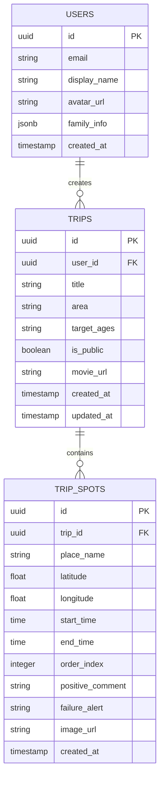

# データベース設計書

## 1. 目的
本ドキュメントは、FamilyTrip Planner（仮）においてSupabase (PostgreSQL) 上に構築するデータベースのスキーマ構造、テーブル定義、およびリレーションシップを定義する。

## 2. ER図

## 3. テーブル定義

Supabase Authと連携するため、`USERS` テーブルは Supabase が提供する `auth.users` テーブルとトリガーを用いて同期させる設計を推奨する。

### 3.1 USERS（ユーザーテーブル）
ユーザーの基本情報とプロファイル情報を管理する。

| 物理論理名 | データ型 | PK/FK | 制約 | 説明 |
|---|---|---|---|---|
| `id` | uuid | PK | NOT NULL | Supabase Authの `auth.users.id` と一致する一意識別子 |
| `email` | varchar(255) | | UNIQUE, NOT NULL | メールアドレス |
| `display_name` | varchar(100) | | NOT NULL | 表示名（ニックネーム） |
| `avatar_url` | text | | | アイコン画像のURL |
| `family_info` | jsonb | | | 家族構成データ（例: `{"children": [{"age": 8, "gender": "male"}]}`） |
| `created_at` | timestamptz | | DEFAULT NOW() | レコード作成日時 |

### 3.2 TRIPS（旅程テーブル）
旅行プランのメタデータ（全体情報）を管理する。

| 物理論理名 | データ型 | PK/FK | 制約 | 説明 |
|---|---|---|---|---|
| `id` | uuid | PK | DEFAULT uuid_generate_v4() | 旅程の一意識別子 |
| `user_id` | uuid | FK | REFERENCES USERS(id) ON DELETE CASCADE | 作成者のユーザーID |
| `title` | varchar(200) | | NOT NULL | プランのタイトル（例：「箱根1泊2日満喫コース」） |
| `area` | varchar(100) | | NOT NULL | 行き先エリア（例：「箱根」「沖縄」） |
| `target_ages` | varchar(100) | | | 対象年齢層タグ（例：「小学生」「未就学児」等） |
| `is_public` | boolean | | DEFAULT false | 公開ステータス。trueで検索一覧に表示される |
| `movie_url` | text | | | 生成された思い出ムービーのS3/Storage URL |
| `created_at` | timestamptz | | DEFAULT NOW() | レコード作成日時 |
| `updated_at` | timestamptz | | DEFAULT NOW() | レコード更新日時 |

### 3.3 TRIP_SPOTS（スポットテーブル）
旅程に含まれる個々の目的地（スポット）と、それに対する評価・注意点を管理する。

| 物理論理名 | データ型 | PK/FK | 制約 | 説明 |
|---|---|---|---|---|
| `id` | uuid | PK | DEFAULT uuid_generate_v4() | スポットの一意識別子 |
| `trip_id` | uuid | FK | REFERENCES TRIPS(id) ON DELETE CASCADE | 属する旅程のID |
| `place_name` | varchar(200) | | NOT NULL | スポット・施設名 |
| `latitude` | float8 | | | 緯度（GoogleマイマップKML出力用） |
| `longitude` | float8 | | | 経度（GoogleマイマップKML出力用） |
| `start_time` | time | | | 滞在開始予定時間 |
| `end_time` | time | | | 滞在終了予定時間 |
| `order_index` | int4 | | NOT NULL | 旅程内での並び順（0始まり） |
| `positive_comment`| text | | | 振り返り時のポジティブな一言感想 |
| `failure_alert` | text | | | ⚠️アイコンで表示される失敗・注意点 |
| `image_url` | text | | | ユーザーがアップロードした写真のURL |
| `created_at` | timestamptz | | DEFAULT NOW() | レコード作成日時 |

## 4. セキュリティ要件 (RLS)
SupabaseのRow Level Security (RLS) を用い、以下のポリシーを適用する。

- **USERS**:
  - `SELECT`: 全員が参照可能（プロフィール表示用）。
  - `UPDATE`: 自身(`auth.uid() = id`)のレコードのみ更新可能。
- **TRIPS**:
  - `SELECT`: `is_public = true` のレコードは全員が参照可能。`is_public = false` のレコードは作成者自身のみ参照可能。
  - `INSERT/UPDATE/DELETE`: 作成者自身のみ可能。
- **TRIP_SPOTS**:
  - `SELECT`: 紐づく `TRIPS` レコードのアクセス権に準ずる。
  - `INSERT/UPDATE/DELETE`: 紐づく `TRIPS` の作成者自身のみ可能。
