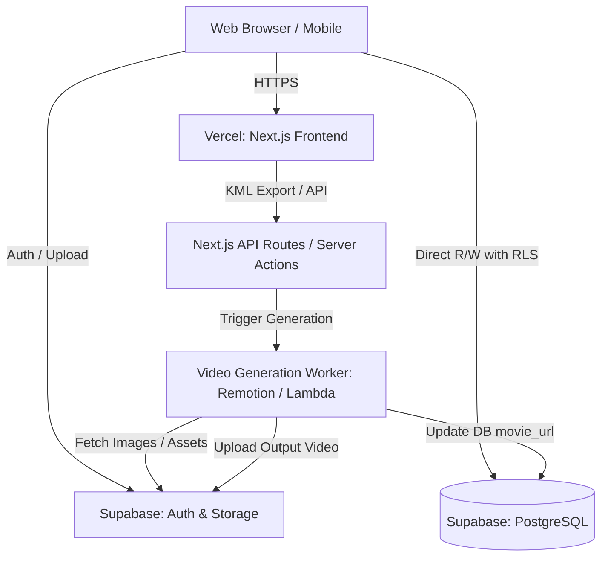

# システムアーキテクチャ設計書

## 1. 目的
本ドキュメントは、FamilyTrip Planner（仮）の全体的なシステム構成、採用する技術スタック、および各コンポーネント間の連携方式を定義する。

## 2. 技術スタック
本システムは、高い開発速度、SEO最適化、リアルタイムデータ連携を目的とし、以下のモダンな技術スタックを採用する。

| レイヤー | 採用技術 | 選定理由 |
|---|---|---|
| **フロントエンド** | **Next.js 14+ (App Router)**<br>React, Tailwind CSS | サーバーサイドレンダリング(SSR)によるSEO対策と初期表示の高速化。App Routerの導入によるデータフェッチの効率化。 |
| **言語** | **TypeScript** | 型安全によるコンパイル時のエラー検知、大規模開発における保守性・開発体験の向上。 |
| **バックエンド / API** | **Next.js Route Handlers**<br>(Server Actions) | フロントエンドとAPIを単一のリポジトリで管理し、BFF（Backends For Frontends）としての役割を担うため。 |
| **データベース / 認証** | **Supabase**<br>(PostgreSQL, Auth, Storage) | RLS(Row Level Security)による堅牢なデータ保護、SNS認証の容易な組み込み、画像・動画などのファイルストレージがオールインワンで提供されるため。 |
| **ホスティング** | **Vercel** | Next.jsとの親和性が最も高く、エッジネットワークによる高速配信、ゼロコンフィグでのデプロイが可能なため。 |
| **動画生成エンジン** | **Remotion** (Lambda等で稼働想定) | Reactコンポーネントをそのまま動画としてレンダリングできるため、フロントエンドの技術スタックを流用しやすく、動的な動画生成に最適。 |

## 3. アーキテクチャ概要

システム全体は、クライアント（ブラウザ/モバイル）、フロントエンドホスティング（Vercel）、BaaS（Supabase）、および動画生成ワーカーから構成される。

### 3.1 アーキテクチャ概要図



### 3.2 コンポーネントの役割
- **Client (Web Browser / Mobile)**: ユーザーインターフェース。認証情報の取得後、読み取り処理の一部はSupabaseへ直接アクセスし、動画生成トリガーやKML出力などの複雑な処理はVercelのAPIを経由する。
- **Vercel (Next.js)**: SSR/SSGを用いたページ生成、KMLファイルの動的生成、外部ワーカーへの非同期処理のキック（API Routes / Server Actions）を担う。
- **Supabase**: ユーザー認証（Google/SNS）、リレーショナルデータ（旅程・スポット）の保存、ユーザーアップロード画像および生成済み動画の保管（Storage）。RLSにより、クライアントからの直接アクセスを安全に制御する。
- **Video Generation Worker**: フロントエンドのメインスレッドをブロックしないよう、分離された環境（AWS Lambda または Vercel Functions）でRemotionを動作させ、動画を生成・アップロードする。

## 4. コンポーネント設計（フロントエンド）

Next.js App Routerの思想に基づき、Server Components（RSC）とClient Componentsを明確に分離する。

### 4.1 コンポーネント階層図

```mermaid
graph TD
    Layout[app/layout.tsx: Server Component]
    Layout --> Providers[Client Providers: Context/Jotai]
    Providers --> Header[Header: Client Component for Auth State]
    Providers --> Page[app/trips/[id]/page.tsx: Server Component]
    
    Page --> TripDetails[TripDetails: Server Component]
    TripDetails --> SpotList[SpotList: Server Component]
    
    Page --> InteractiveArea[InteractiveArea: Client Component]
    InteractiveArea --> CopyButton[CopyButton: Client Component]
    InteractiveArea --> KMLExportButton[KMLExportButton: Client Component]
    
    Providers --> EditPage[app/trips/[id]/edit/page.tsx: Server Component]
    EditPage --> DndContext[DndContext: Client Component]
    DndContext --> DraggableSpotList[DraggableSpotList: Client Component]
```

### 4.2 主要コンポーネントの方針

1. **`app/trips/[id]/page.tsx` (Server Component)**
   - **役割**: 公開された旅程詳細ページの表示。
   - **方針**: SEOを考慮し、Supabaseクライアントを用いてサーバーサイドで直接データをフェッチする。子コンポーネント（静的表示用）へはPropsとしてデータを渡す。

2. **`DraggableSpotList` (Client Component)**
   - **役割**: 旅程のスポットをドラッグ＆ドロップで並び替えるUI。
   - **方針**: `dnd-kit`等のライブラリを使用するため `"use client"` ディレクティブを指定。並び替えのローカルステートは `useState` 等で管理し、確定時にServer ActionsまたはAPI Routeへデータを送信して永続化する。

3. **`KMLExportButton` (Client Component)**
   - **役割**: ユーザーの操作でKMLファイルを生成・ダウンロードするトリガー。
   - **方針**: ボタンクリック時に `GET /api/trips/{tripId}/export-kml` を呼び出し、レスポンスのBlobデータをブラウザ上でファイルとしてダウンロードさせる。

### 4.3 状態管理方針
- **サーバー状態**: Next.js App Routerのデータフェッチ（キャッシュ含む）とServer Actionsを基本とし、複雑なクライアント側ライブラリ（React Query等）の導入は最小限にとどめる。
- **グローバル状態（クライアント）**: 認証状態（ログインユーザー情報）やUIのテーマ（ダークモード等）は、React Context または Zustand / Jotai などの軽量ライブラリを利用。
- **ローカル状態**: フォーム入力中のデータやモーダルの開閉状態は、各コンポーネント内の `useState` / `useReducer` で管理する。
