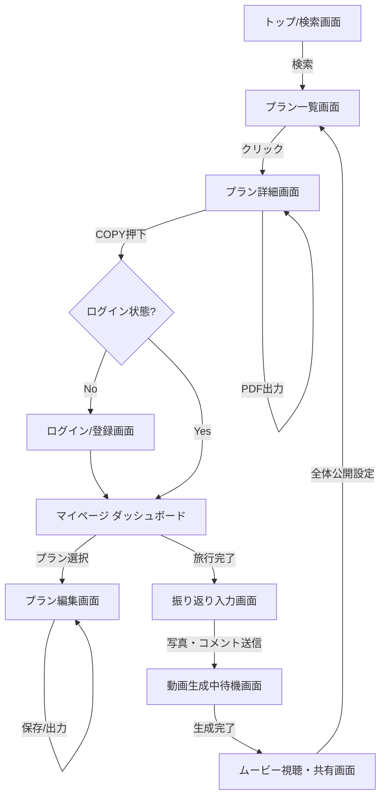

# UI/UX設計書

## 1. 目的
本ドキュメントは、FamilyTrip Planner（仮）のユーザーインターフェースと体験の方向性を定義し、開発およびデザインにおける一貫した指針を提供する。

## 2. デザインコンセプト

- **テーマ**: **「World Traveler（空港・パスポート・旅）」**
- **コンセプト**: ワクワクする非日常感と、情報を探しやすいモダンさの両立。煩雑な計画作業や振り返り入力を「旅の記録を残す」というポジティブな体験に昇華させる。

### 2.1 デザインシステム
- **カラーパレット**:
  - `Primary` (深いネイビー): `#1A2B4C` （パスポート、夜空。ヘッダーや主要ボタンに使用）
  - `Background` (ライトグレー): `#F4F5F7` （背景色。清潔感と情報の読みやすさを担保）
  - `Surface` (ホワイト): `#FFFFFF` （カード、モーダルの背景）
  - `Accent - Success` (スカイブルー): `#00A4E5` （おすすめ、ポジティブな要素、成功アクション）
  - `Accent - Alert` (アラートイエロー): `#FFD166` （失敗アラート、注意喚起。視認性は高いが威圧感を与えない色）
- **タイポグラフィ**:
  - 基本フォント: `Noto Sans JP` または `Inter` （読みやすさ重視のモダンなサンセリフ）
  - 見出し・装飾フォント: 空港の出発ボードを彷彿とさせる等幅フォントや少し無骨なフォント（ロゴや日付、時刻表示にアクセントとして使用）
- **UIコンポーネントの形状**:
  - カードやボタンの角丸（border-radius）は適度（`8px`程度）にし、親しみやすさとプロフェッショナルさを両立する。

## 3. 画面一覧と画面遷移図

### 3.1 画面遷移図 (Mermaid)



### 3.2 主要画面の役割
1. **トップ/検索画面**: 出発案内板風のUI。行き先や年齢でサクサク検索できるエントリーポイント。
2. **プラン詳細画面**: 他者のプランを閲覧する画面。タイムラインと「失敗アラート」が分かりやすく可視化される。COPYとエクスポート（KML/PDF）の導線を持つ。
3. **マイページ**: パスポート風UI。自分が作成・コピーしたプランの管理や、獲得した称号（スタンプ）を確認できる。
4. **プラン編集画面**: ドラッグ＆ドロップでタイムラインを編集し、自分だけの計画を練る画面。
5. **振り返り入力画面**: 旅行の思い出と反省（失敗タグ）を簡単に入力できる画面。モバイルでのアップロードしやすさを最優先する。

## 4. ワイヤーフレーム (主要画面)

### 4.1 プラン詳細画面（閲覧用）
ユーザーが他者のプランを見て「これを使おう」と判断するコア画面。

```text
+---------------------------------------------------+
| [Logo] FamilyTrip Planner        [Search] [Login] |
+---------------------------------------------------+
|                                                   |
| [ ヘッダー画像 (代表的な現地の写真) ]               |
|                                                   |
| ✈️ 箱根1泊2日 家族で温泉満喫コース                  |
| ------------------------------------------------- |
| 👤 サトシ   👪 対象: 幅広い年齢   📍 エリア: 箱根   |
+---------------------------------------------------+
| [📤 KML出力(Map用)] [📄 しおり出力] [➕ COPYする] |
+---------------------------------------------------+
| ▼ タイムライン                                    |
|                                                   |
| [10:00] 📍 箱根彫刻の森美術館                       |
|   |   😊 広い芝生で走り回れる！最高！             |
|   |   🖼️ [ユーザー投稿写真サムネイル]             |
|   |                                               |
| [12:30] 📍 レストラン○○                             |
|   |   ⚠️ 【アラート】 お昼時は1時間待ち！           |
|   |   💡 子供用椅子あり、辛くないメニューあり     |
|   |                                               |
| [15:00] 📍 ホテル△△                                 |
|       😊 ファミリールーム最高！                     |
+---------------------------------------------------+
```
**インタラクション**: 
- COPYボタンを押すとフワッとパスポート（マイページ）にスタンプが押されるようなアニメーション。
- KML出力/しおり出力を押すと、それぞれのダウンロード処理が走る。

### 4.2 プラン編集画面
コピーしたプランを自分用にカスタマイズする画面。

```text
+---------------------------------------------------+
| [🔙 戻る]   編集: 箱根1泊2日コース        [💾 保存] |
+---------------------------------------------------+
|                                                   |
| ⠿ [10:00 - 12:00] 箱根彫刻の森美術館  [✕]         |
| ------------------------------------------------- |
| ⠿ [12:30 - 13:30] レストラン○○        [✕]         |
|   └ ⚠️ アラート: お昼時は1時間待ち                |
| ------------------------------------------------- |
| ⠿ [15:00 -      ] ホテル△△            [✕]         |
|                                                   |
|  [ ＋ 新しいスポットを追加する ]                  |
|                                                   |
+---------------------------------------------------+
| 💡 ヒント: 「⠿」をドラッグして順番を入れ替えられます|
+---------------------------------------------------+
```
**インタラクション**:
- `⠿` (ドラッグハンドル) を掴んで上下に移動させると、リストのアニメーションが滑らかに追従する（dnd-kit使用）。
- 順番を入れ替えた際、移動時間の辻褄が合わなくなった場合は警告アイコンが出る、または自動計算機能を提供する。
