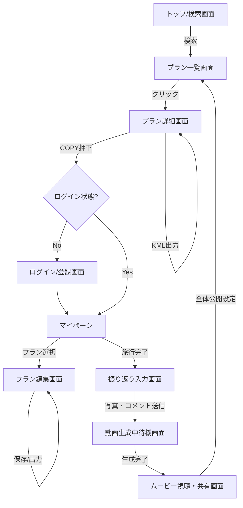
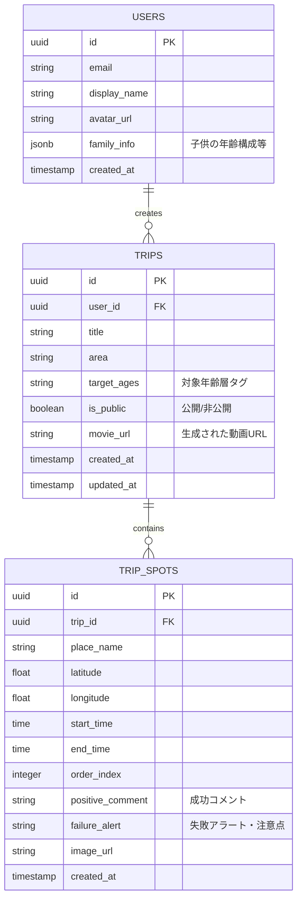
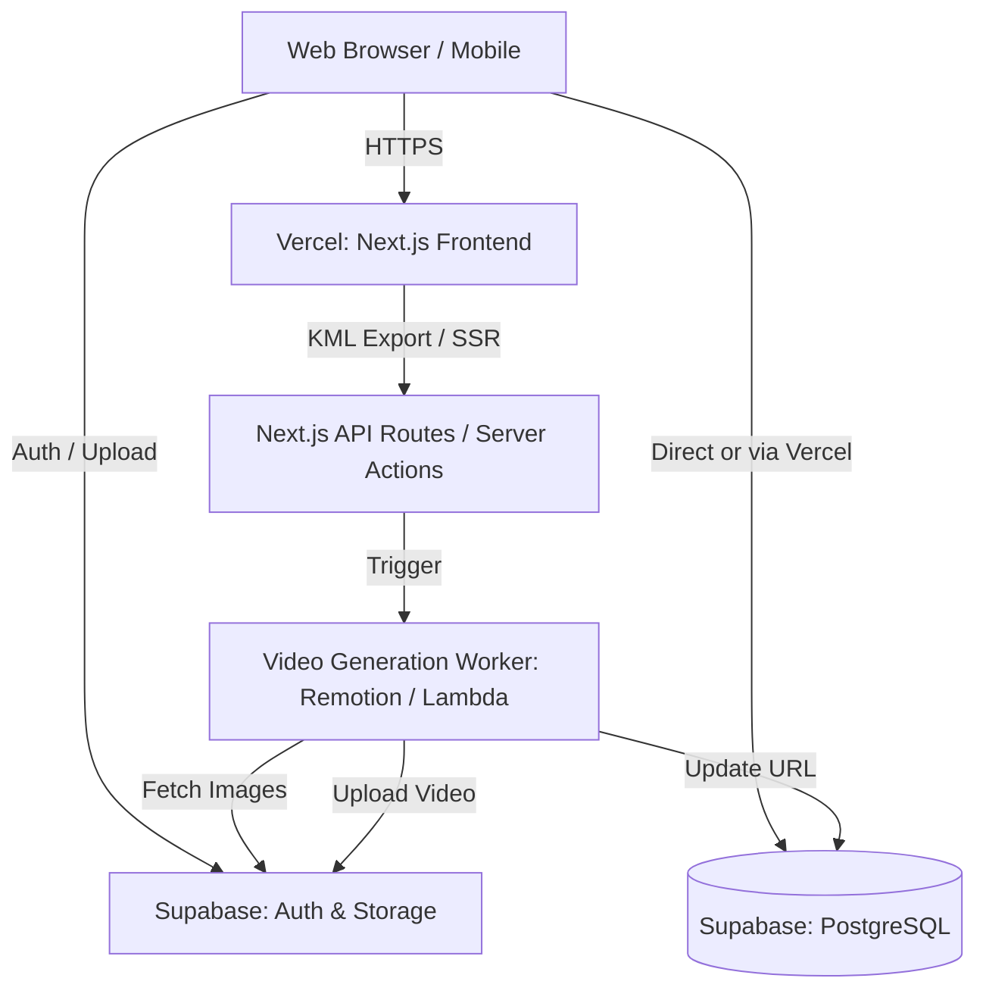

# 詳細要件定義書

## 1. プロジェクト概要

### 1.1 プロジェクト名
- **FamilyTrip Planner（仮）**

### 1.2 背景・目的
- **背景**: 子連れ旅行において、大人だけの旅行とは異なる視点（トイレ、食事の辛さ、安全性など）でのリサーチが必要だが、情報が各所に分散している。また、インフルエンサーの投稿は成功体験に偏りがちで、「行ってみて大変だった」というリアルな失敗情報が得にくいという課題がある。
- **目的**: ユーザーが他者の成功体験とリアルな失敗情報（To-Don't）を元に安全・安心な旅程を作成・実行できるようにすること。旅行後には自動生成される「思い出ムービー」をインセンティブとして提供し、情報の提供サイクルを回すこと。

### 1.3 システムのビジョン / スコープ
- **ビジョン**: 「先人の知恵（成功と失敗）を借りて、家族旅行をアップデートする」。すべての家族が失敗を恐れず、子供との旅行を最大限楽しめる世界を目指す。
- **スコープ**: 今回の開発対象はWebブラウザで動作するWebアプリケーション（スマホ最適化含む）。旅程の検索・コピー、プラン編集、GoogleマイマップへのKMLエクスポート、振り返り投稿、BGM・アニメーション付きムービー生成機能、および子供向けの「旅のしおり」PDF生成機能をMVPスコープとする。ホテル・アクティビティの外部予約機能は本フェーズでは対象外。

---

## 2. ビジネス要件

### 2.1 ビジネスモデル情報
- **リーンキャンバス要約**:
  - **課題**: 子連れ旅行の計画の手間、リアルな失敗情報の欠如、写真・思い出整理の手間。
  - **顧客セグメント**: 幅広い年齢層の子供を持つ、旅行好きなパパママ。
  - **独自の価値提案**: 成功プランのコピーと「失敗アラート」によるリスク回避、プランから自動生成される「思い出ムービー」。
  - **ソリューション**: 旅程共有・編集プラットフォーム＋Googleマイマップ連携＋動画生成。
  - **チャネル**: SNS（Instagram, X）、検索エンジン、口コミ。
  - **収益の流れ**: 初期は無料（ユーザー獲得優先）、中長期的にはプレミアム機能（高画質動画ダウンロード等）によるマネタイズ（アフィリエイトは除外）。
  - **コスト構造**: 開発・運用費（Vercel, Supabase）、動画生成処理インフラ費。
  - **主要指標**: 旅程作成数、プラン投稿率、Mapエクスポート数。
  - **圧倒的な優位性**: ユーザー自身の「思い出ムービー」を作るという強い動機に基づく、質の高い失敗情報（UGC）の蓄積。

### 2.2 成果指標（KPI/KGI）
- **KGI**: プロダクトの月間アクティブユーザー (MAU) 1,000人をリリース後3ヶ月で達成。
- **KPI**:
  - 月間旅程作成数: 500件
  - プラン投稿率（旅行後の振り返り入力・公開率）: 30%
  - GoogleマイマップへのKMLエクスポート数: 300件/月

### 2.3 ビジネス上の制約
- **予算・開発期間**: MVPフェーズの開発期間は約1.5〜2ヶ月。初期費用を抑えるため、SaaSの無料枠・低価格帯（Vercel, Supabase）を最大限活用する。
- **法的要件**: ユーザーのプライバシー保護（子供の写真や位置情報）。顔写真を含む動画のデフォルト非公開設定など、プライバシーに配慮した設計が必須。

---

## 3. ユーザー要件

### 3.1 ユーザープロファイル / ペルソナ
- **メインペルソナ**: 旅行好きパパママ（例: サトシ・34歳・会社員）
  - 20代〜40代、既婚、様々な年齢の子供を持つ。
  - **利用シーン**: 休日や夜間に自宅のPC・タブレットでじっくり計画。旅行中はスマホで地図やメモを確認。
  - **課題**: インスタの情報を元に行ってみたら、ベビーカー非対応で大変な思いをした経験がある。計画の手間を減らしつつ、確実に子供が楽しめる旅行にしたい。

### 3.2 ユーザーストーリー
1. **計画効率化**: パパママとして、同年代の子供を持つ他の家族の成功プランをそのままコピーしたい。なぜなら、ゼロから調べる時間と労力を省きたいからだ。
2. **リスク回避**: 慎重派の親として、旅程上の「トイレが汚い」「待ち時間が長い」といった失敗情報を事前に知りたい。なぜなら、現地での想定外のトラブルや子供のぐずりを防ぎたいからだ。
3. **現地での実用性**: 旅行者として、作成したプランをGoogleマイマップにKML出力したい。なぜなら、使い慣れたGoogle Mapのナビ機能でスムーズに移動したいからだ。
4. **思い出整理**: 思い出を残したい親として、写真と一言コメントを投稿するだけでエモい動画（BGM・アニメ付き）を作ってほしい。なぜなら、動画編集のスキルや時間がなくても子供の成長記録を残したいからだ。

### 3.3 MVP（Minimum Viable Product）の定義
- **MVPで実装する範囲**: アカウント登録、旅程の検索・コピー・編集、失敗アラート（アイコン表示）、GoogleマイマップへのKMLエクスポート、振り返り入力、BGM・アニメ付きショートムービー生成、子供向け「旅のしおり」PDF生成。
- **MVPのゴール**: 「人のプランをコピーしてGoogle Mapで使う」体験の価値検証と、「ムービーがもらえるなら面倒な振り返り入力をするか」という仮説検証を早期に行うこと。

---

## 4. 機能要件

### 4.1 機能一覧 / MoSCoW 分類

| 機能ID | 機能名 | 要約 | 分類 | MVP対象 |
|---|---|---|---|---|
| F-001 | 会員登録・ログイン | Supabase Auth(Google/SNS認証)によるサインアップ・ログイン | Must | Yes |
| F-002 | プロフィール設定 | 家族構成（子供の年齢、性別など）の登録 | Must | Yes |
| F-003 | 旅程検索 | エリア、子供の年齢、タグで公開プランを検索 | Must | Yes |
| F-004 | プラン詳細表示 | タイムライン形式でスポットと注意点（失敗アラート）を表示 | Must | Yes |
| F-005 | プランコピー＆編集 | 他者のプランを複製し、ドラッグ＆ドロップで入れ替え・時間変更 | Must | Yes |
| F-006 | KMLエクスポート | 作成したプランをGoogleマイマップ用KMLファイルとして出力 | Must | Yes |
| F-007 | 振り返り・評価入力 | 実施プランに対する評価、失敗情報タグの選択、写真アップロード | Must | Yes |
| F-008 | ムービー自動生成 | 旅程、コメント、写真からBGM・アニメ付き動画を生成 | Must | Yes |
| F-009 | プラン公開設定 | 生成完了後、自分のプランを全体公開にする設定 | Must | Yes |
| F-010 | 役に立ったボタン | 他のプランに対する感謝のアクション | Should | No (Phase 2) |
| F-011 | ユーザーランク | 投稿数や評価に応じた称号（スタンプ）付与 | Should | No (Phase 2) |
| F-012 | 旅のしおりPDF出力 | 印刷用の可愛いしおりの生成 | Must | Yes |

### 4.2 機能詳細仕様

#### 4.2.1 <機能ID: F-005 プランコピー＆編集>
- **概要**: 検索で見つけた他ユーザーの旅程を自分のアカウントに複製し、ドラッグ＆ドロップでカスタマイズする機能。
- **ユースケース**: 「自分と似た家族構成のプランを見つけ、ランチの場所だけ自分好みに変えたいとき」
- **前提条件**: ログイン済みであること。
- **正常系フロー**:
  1. 公開プラン詳細画面で「このプランをCOPY」ボタンを押下。
  2. プランデータ（スポット、時間、メモ、失敗タグ等）が複製され、マイページの編集画面に遷移。
  3. スポットのドラッグ＆ドロップで順番を入れ替え、滞短時間を調整。
  4. 新たなスポットを検索して追加、または不要なスポットを削除。
  5. 「保存」ボタン押下でDB（Supabase）に更新を保存。
- **例外系フロー**:
  - ドラッグ＆ドロップによる時間順序の矛盾（前のスポットより開始時間が早くなる等）が発生した場合、自動的に後続スポットの時間をスライド調整する。
- **UI要件**:
  - 航空券風のタイムラインUI。直感的なドラッグ＆ドロップ操作（dnd-kit等を想定）。

#### 4.2.2 <機能ID: F-006 KMLエクスポート>
- **概要**: 編集済みの旅程データをKML（Keyhole Markup Language）フォーマットで出力し、Googleマイマップにインポート可能にする。
- **ユースケース**: 「旅行前日に、作成したプランをGoogle Mapで使えるように準備するとき」
- **前提条件**: 旅程データに有効な位置情報（緯度・経度）が含まれていること。
- **正常系フロー**:
  1. マイページのプラン詳細画面で「Googleマイマップへ書き出し」ボタンを押下。
  2. サーバー側でプランの各スポット座標・名前・メモ（失敗タグ含む）からKMLファイルを動的生成。
  3. KMLファイルがユーザー端末にダウンロードされる。
  4. 画面上に「Googleマイマップへのインポート手順」のモーダルを表示。
- **例外系フロー**:
  - スポットに位置情報がない場合、アラートを表示してスキップして出力するかエラーとする。

#### 4.2.3 <機能ID: F-008 ムービー自動生成>
- **概要**: 振り返り時に入力された写真・テキストから、Remotion等を活用しBGMとアニメーション付きのショートムービーを非同期で生成する。
- **ユースケース**: 「旅行後に写真と感想を入力し、思い出を動画として保存・共有したいとき」
- **正常系フロー**:
  1. 振り返り画面で写真アップロードとコメント入力を完了し「投稿してムービーを作る」を押下。
  2. 画像がSupabase Storageにアップロードされ、動画生成リクエストがバックグラウンド処理（Lambda等）に送られる。
  3. ユーザーには「動画生成中です。完了したら通知します」と表示。
  4. 生成完了後、マイページ上で動画が再生可能になり、ダウンロードリンクが有効化される。

---

## 5. UI/UX設計

### 5.1 デザインコンセプト
- **World Traveler（空港・パスポート・旅）**
  - ワクワクする非日常感と、情報を探しやすいモダンさを両立。
- **カラーパレット**:
  - メインカラー: ディープネイビー `#1A2B4C` （パスポート、夜空）
  - サブカラー: ホワイト `#FFFFFF`, ライトグレー `#F4F5F7` （清潔感）
  - アクセント（成功/おすすめ）: スカイブルー `#00A4E5`
  - アクセント（失敗/アラート）: アラートイエロー `#FFD166`
- **タイポグラフィ**: 視認性が高くモダンなサンセリフ体（Noto Sans JP, Inter等）。タイトルには空港の出発ボード風の少し無骨なフォントを使用。

### 5.2 画面一覧
1. **トップ画面 / 検索画面**: 出発案内板風のUIでプランを検索。
2. **プラン一覧画面**: 検索結果をカード（航空券風）で表示。
3. **プラン詳細画面（閲覧用）**: タイムライン表示、KMLエクスポートボタン、COPYボタン。
4. **マイページ（ダッシュボード）**: パスポート風UI、スタンプ、作成中/完了済みプラン一覧。
5. **プラン編集画面**: ドラッグ＆ドロップでタイムラインを編集。
6. **振り返り入力画面**: スポットごとの写真・評価・失敗タグ入力UI。
7. **ムービー視聴・共有画面**: 生成された動画の再生、ダウンロード、SNSシェア。

### 5.3 画面遷移図 (Mermaid)



### 5.4 ワイヤーフレーム (テキストベース)
**【プラン詳細画面（閲覧用）ワイヤーフレーム】**
```text
+---------------------------------------------------+
| [Logo] FamilyTrip Planner        [Search] [Login] |
+---------------------------------------------------+
| [ ヘッダー画像 (代表的な写真) ]                     |
| タイトル: 箱根1泊2日 家族で温泉満喫コース           |
| 投稿者: サトシ  | 対象: 幅広い年齢 | エリア: 箱根   |
+---------------------------------------------------+
| [KMLエクスポート]   [このプランをCOPY]             |
+---------------------------------------------------+
| タイムライン                                      |
| 10:00 [Spot] 箱根彫刻の森美術館                   |
|       - 広い芝生で走り回れる (おすすめ)           |
|                                                   |
| 12:30 [Spot] レストラン○○                         |
|       [⚠️ 失敗アラート: お昼時は1時間待ち！]      |
|       - 子供用椅子あり、辛くないメニューあり      |
|                                                   |
| 15:00 [Spot] ホテル△△                             |
|       - ファミリールーム最高！                    |
+---------------------------------------------------+
```

---

## 6. 非機能要件

- **パフォーマンス**:
  - 初期ユーザー1,000人規模を想定。
  - 主要画面のレスポンス（TTFB）は1秒以内。ドラッグ＆ドロップなどのUI操作は60fpsを維持する。
  - 動画生成は非同期キューを使用し、リクエストから5分以内に完了させる。
- **スケーラビリティ**:
  - Vercelによるフロントエンドの自動スケール、Supabase（DB・Storage）のスケーラビリティに依存。UGC（画像・動画）増大に備え、Supabase Storageの容量監視を行う。
- **セキュリティ**:
  - 通信はすべてHTTPS。
  - 認証はSupabase Authを利用し、パスワード等の直接管理を避ける。
  - **RLS (Row Level Security)** を設定し、非公開のプランや写真は本人以外アクセス不可とする。
- **可用性**: 99.9% の稼働率を目指す。
- **ユーザビリティ**: スマートフォンからの「振り返り入力」や「地図確認」を想定し、タップしやすい大きなボタン配置（モバイルファースト）。

---

## 7. データベース設計

### 7.1 ER図 (Mermaid)



### 7.2 テーブル定義（主要テーブル）
- **TRIPS (旅程テーブル)**
  - `id`: UUID (Primary Key)
  - `user_id`: UUID (Foreign Key -> USERS.id)
  - `title`: VARCHAR (旅程のタイトル)
  - `area`: VARCHAR (箱根、沖縄など)
  - `is_public`: BOOLEAN (デフォルト: false)
  - `movie_url`: VARCHAR (動画生成後のS3/Supabase Storage URL)
  - *備考*: `is_public` が true のものだけが検索結果に表示される。

- **TRIP_SPOTS (スポットテーブル)**
  - `id`: UUID (Primary Key)
  - `trip_id`: UUID (Foreign Key -> TRIPS.id, カスケード削除)
  - `latitude` / `longitude`: FLOAT (GoogleマイマップKML出力時に必須)
  - `order_index`: INT (ドラッグ＆ドロップ時の並び順制御用)
  - `failure_alert`: TEXT (失敗情報、⚠️アイコンで表示される内容)

---

## 8. インテグレーション要件

### 8.1 外部サービス / SaaS 連携
- **認証・DB・ストレージ**: Supabase (Auth, Postgres DB, Storage)
- **ホスティング**: Vercel
- **動画生成**: Remotionベースのサーバーレス関数 (AWS Lambda もしくは Vercel Functions 上で稼働想定)
- **地図出力**: (Google Maps APIを直接は叩かず) アプリ側でKMLフォーマットのXMLテキストを動的生成し、ダウンロードさせる。

### 8.2 API 仕様 (Next.js Route Handlers 経由の場合)
クライアントからSupabaseを直接叩くか、サーバーサイドAPIを経由する。動画生成トリガー等はAPIを経由。

- **エンドポイント**: `POST /api/trips/{tripId}/generate-movie`
  - **機能**: 振り返り完了時に動画生成のキューへタスクを登録する
  - **リクエスト**:
    ```json
    {
      "tripId": "uuid-string",
      "bgmType": "pop",
      "style": "passport-theme"
    }
    ```
  - **レスポンス (202 Accepted)**:
    ```json
    {
      "status": "processing",
      "jobId": "job-uuid-string"
    }
    ```

- **エンドポイント**: `GET /api/trips/{tripId}/export-kml`
  - **機能**: KMLファイルを生成して返す
  - **レスポンス**: `Content-Type: application/vnd.google-earth.kml+xml`
  - **ボディ**: KML形式のXMLデータ

---

## 9. 技術選定とアーキテクチャ

### 9.1 技術スタック
- **フロントエンド・バックエンド**: Next.js 14+ (App Router), React, TypeScript
- **スタイリング**: Tailwind CSS (UIコンポーネントにshadcn/uiの活用を推奨)
- **データベース・認証・ストレージ**: Supabase (PostgreSQL, Supabase Auth, Storage)
- **動画生成エンジン**: Remotion
- **ホスティング**: Vercel

### 9.2 アーキテクチャ概要図 (Mermaid)



### 9.3 コンポーネント階層図 (Mermaid)

```mermaid
graph TD
    Layout[app/layout.tsx: Server Component]
    Layout --> Providers[Client Providers: Context/Jotai]
    Providers --> Header[Header: Client Component for Auth State]
    Providers --> Page[app/trips/[id]/page.tsx: Server Component]
    
    Page --> TripDetails[TripDetails: Server Component]
    TripDetails --> SpotList[SpotList: Server Component]
    
    Page --> InteractiveArea[InteractiveArea: Client Component]
    InteractiveArea --> CopyButton[CopyButton: Client Component]
    InteractiveArea --> KMLExportButton[KMLExportButton: Client Component]
    
    Providers --> EditPage[app/trips/[id]/edit/page.tsx: Server Component]
    EditPage --> DndContext[DndContext: Client Component]
    DndContext --> DraggableSpotList[DraggableSpotList: Client Component]
```

### 9.4 コンポーネント設計方針
- **Server Components (RSC)**: 検索結果一覧やプラン詳細画面の初期表示など、SEOが重要で非対話的な部分はRSCで実装し、Supabaseクライアントを用いてサーバー側で直接データフェッチを行う。
- **Client Components**: ドラッグ＆ドロップ（`DndContext`）、ボタンのアクション（COPY、KML出力、動画生成トリガー）など、対話性が必要な箇所のみ `"use client"` ディレクティブを指定する。
- **状態管理**: フォーム入力やドラッグ＆ドロップのローカルステートは `useState` や `useReducer` を利用。アプリ全体で共有する状態（ログインユーザー情報など）は Supabase Auth のセッションリスナーと React Context (または軽量な Zustand) で管理する。

---

## 10. リスクと課題

| No | リスク内容 | 影響度 | 発生確率 | 対応策 |
|---|---|---|---|---|
| R1 | 動画生成インフラの負荷増大とコスト超過 | 高 | 中 | RemotionのレンダリングをローカルLambda等で分離し、タイムアウトや並列実行数を厳密に制御する。 |
| R2 | コールドスタート（初期コンテンツ不足）によるユーザー離脱 | 高 | 高 | リリース前に運営側やアンバサダーがシードデータ（旅程と写真）を数十〜数百件事前投入しておく。 |
| R3 | RLS設定ミスによるプライベートデータ（子供の写真等）の漏洩 | 致命的 | 低 | SupabaseのRLSポリシーのテストコードを記述し、CI/CDで必ず検証する体制を敷く。 |
| R4 | KMLファイルの互換性問題 | 中 | 中 | GoogleマイマップのKML仕様（タグの入れ方、アイコン指定）を事前にPoCで検証し、正しくインポートできるか確認する。 |

---

## 11. ランニング費用と運用方針

### 11.1 ランニング費用の目安（初期フェーズ）
- **Vercel**: Hobbyプラン ($0/月) 〜 トラフィック増で Proプラン ($20/月)
- **Supabase**: Freeプラン ($0/月) 〜 容量・帯域増で Proプラン ($25/月)
- **動画生成インフラ (AWS Lambda等)**: 従量課金。初期は無料枠に収まる可能性が高いが、生成回数が増えると数千円〜/月。
- **合計概算**: 初期は月額 $0 〜 $50 程度でスモールスタート可能。

### 11.2 運用・保守体制
- **運用チーム**: ファウンダー（エンジニア兼任）を中心に監視。
- **監視ツール**: Vercel Analytics（アクセス監視）、Supabase Dashboard（DB容量・APIエラー監視）。必要に応じて Sentry 等を導入しクライアントエラーを捕捉。
- **運用タスク**: 不適切コンテンツ（プライバシー侵害の恐れがある写真や不適切なコメント）のパトロールと非公開対応。

---

## 12. 変更管理
- 新規機能追加や要件変更は、GitHub Issues にて起票し、ビジネス影響と工数を評価した上で実装スコープ（Next MVPなど）を決定する。
- ソースコードは GitHub で管理し、Main ブランチへのマージは Pull Request 経由で行う。Vercel によるプレビューデプロイ環境を利用して動作確認を実施する。

---

## 13. 参考資料
- [Next.js Documentation](https://nextjs.org/docs)
- [Supabase Documentation](https://supabase.com/docs)
- [Remotion Documentation](https://www.remotion.dev/docs/)
- [Keyhole Markup Language (KML) チュートリアル](https://developers.google.com/kml/documentation/kml_tut?hl=ja)
- `docs/input/` 内のビジネス・プロダクト要件定義資料
